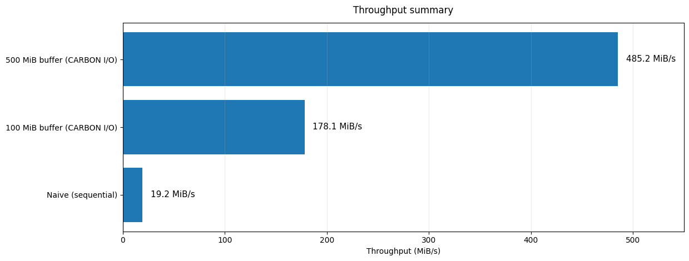
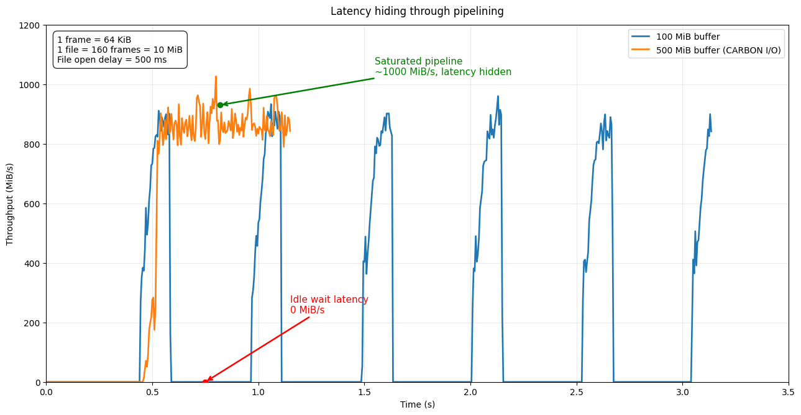

# CARBON I/O

[](https://crates.io/crates/carbon-io)
[](https://docs.rs/carbon-io)
[](https://github.com/theking90000/carbon-io/blob/main/LICENSE)
[](https://github.com/theking90000/carbon-io/blob/main/Cargo.toml)

**Concurrent Async Reordering Buffered Ordered Nonblocking I/O**

CARBON I/O is a Rust library for reading and writing several files concurrently
with bounded buffering and ordered output.

Each file contains frames of your chosen Rust type. CARBON schedules reads and
writes across files, limits buffering, and delivers results in order.

- `ReadScheduler` reads files into a stream of frames in file order.
- `WriteScheduler` distributes admitted frames across destinations and returns
  their finalization results in destination order.

Consuming the stream drives I/O. CARBON starts no background tasks.

Schedulers borrow a shared `&FrameBudget` and a mutable `&mut SchedulerConfig`.
Files are supplied with `poll_file_ready()` followed by `start_file()`;
`WriteScheduler` also accepts owned frames with `poll_frame_ready()` followed by
`start_frame()`. The producer retains its sources and drives admission and output
in the same task. Dropping a scheduler cancels its operations and releases its
budget. `set_window()` updates the caller's configuration.

See the [detailed guide](docs/guide.md) for more on scheduling, buffering,
backpressure, and backend integration.

## Hiding I/O latency

**25× the sequential throughput in this test:** 485.2 MiB/s with CARBON I/O,
versus 19.2 MiB/s sequentially. The smaller pipeline reached 178.1 MiB/s.

Test conditions: a 588 MB source file, split into 10 MiB segments of 160 frames
at 64 KiB each, with an artificial 500 ms delay per file open. The two runs
allowed 10 or 50 active files, covering 100 or 500 MiB of data ahead, with the
same 4,000-frame buffering budget, equivalent to 250 MiB. The charts' “buffer”
labels refer to that file window, not measured memory usage.




## Installation

Add to your `Cargo.toml`:

```toml
[dependencies]
carbon-io = "0.3.2"
futures = "0.3" # StreamExt and the executor used in the examples.
```

Requires Rust 1.85 or newer. Works with any compatible async runtime.
The Tokio snippets below require Tokio.

## Reading files

Implement `ReadFile<T>` for your file descriptors. Each descriptor declares its
frame count and opens a stream that yields exactly that many successful frames,
followed by EOF. Admit each descriptor to `ReadScheduler`, then close file input:

```rust
use std::{convert::Infallible, error::Error, future::{Ready, ready, poll_fn}, ops::Range, pin::Pin};
use futures::{executor::block_on, stream, StreamExt};
use carbon_io::{FrameBudget, ReadFile, ReadScheduler, SchedulerConfig};

struct File(Range<u32>);

impl ReadFile<u32> for File {
    type Error = Infallible;
    type Reader = stream::Iter<std::vec::IntoIter<Result<u32, Infallible>>>;
    type Open = Ready<Result<Self::Reader, Self::Error>>;

    fn frame_count(&self) -> u32 { self.0.end - self.0.start }

    fn open(&self) -> Self::Open {
        ready(Ok(stream::iter(self.0.clone().map(Ok).collect::<Vec<_>>())))
    }
}

fn main() -> Result<(), Box<dyn Error>> {
    block_on(async {
        let budget = FrameBudget::new(64);
        let mut config = SchedulerConfig::default();
        let mut reader = ReadScheduler::new(&budget, &mut config);
        for file in [File(0..3), File(3..5)] {
            poll_fn(|cx| Pin::new(&mut reader).poll_file_ready(cx)).await?;
            Pin::new(&mut reader).start_file(file)?;
        }
        Pin::new(&mut reader).close_files()?;

        let mut values = Vec::new();
        while let Some(frame) = reader.next().await {
            values.push(frame?);
        }
        assert_eq!(values, [0, 1, 2, 3, 4]);
        Ok(())
    })
}
```

### Keep reading while the consumer waits

To keep I/O advancing while processing a frame, poll `progress()` alongside
the consumer's async work:

```ignore
while let Some(frame) = reader.next().await {
    tokio::select! {
        result = write_tcp(frame?) => result?,
        _ = reader.progress() => unreachable!("progress never completes"),
    }
}
```

`progress()` consumes no frames and never completes. Put this `select!` in the
task that awaits the consumer.

## Writing files

Implement `WriteFile<T>` to describe a destination and `FrameWriter<T>` to write
its frames. A destination declares its frame capacity. Its writer accepts frames
by reference and returns a result after finalization:

```rust
use std::{
    convert::Infallible,
    error::Error,
    future::{Ready, ready, poll_fn},
    pin::Pin,
    task::{Context, Poll},
};
use futures::{executor::block_on, StreamExt};
use carbon_io::{FrameBudget, FrameWriter, SchedulerConfig, WriteFile, WriteScheduler};

struct File;
struct Writer(u32);

impl WriteFile<u32> for File {
    type Error = Infallible;
    type Output = u32;
    type Open = Ready<Result<Writer, Infallible>>;
    type Writer = Writer;

    fn frame_capacity(&self) -> u32 { 3 }
    fn open(&self) -> Self::Open { ready(Ok(Writer(0))) }
}

impl FrameWriter<u32> for Writer {
    type Error = Infallible;
    type Output = u32;

    fn poll_write(self: Pin<&mut Self>, _: &mut Context<'_>, frame: &u32)
        -> Poll<Result<(), Infallible>>
    {
        self.get_mut().0 += frame;
        Poll::Ready(Ok(()))
    }

    fn poll_finalize(self: Pin<&mut Self>, _: &mut Context<'_>)
        -> Poll<Result<u32, Infallible>>
    {
        Poll::Ready(Ok(self.0))
    }
}

fn main() -> Result<(), Box<dyn Error>> {
    block_on(async {
        let budget = FrameBudget::new(64);
        let mut config = SchedulerConfig::default();
        let mut writer = WriteScheduler::new(&budget, &mut config);
        for file in [File, File] {
            poll_fn(|cx| Pin::new(&mut writer).poll_file_ready(cx)).await?;
            Pin::new(&mut writer).start_file(file)?;
        }
        Pin::new(&mut writer).close_files()?;
        for frame in [1, 2, 3, 4] {
            poll_fn(|cx| Pin::new(&mut writer).poll_frame_ready(cx)).await?;
            Pin::new(&mut writer).start_frame(frame)?;
        }
        Pin::new(&mut writer).close_frames()?;

        let mut results = Vec::new();
        while let Some(result) = writer.next().await {
            results.push(result?);
        }
        assert_eq!(results, [6, 4]);
        Ok(())
    })
}
```

Input frames fill destinations in order, up to each destination's capacity.
Destinations open only after receiving a frame. The last file may be partial;
an empty input opens no file.

If processing a result involves an asynchronous wait, use the same pattern as
for reads to keep subsequent files writing and finalizing:

```ignore
while let Some(result) = writer.next().await {
    tokio::select! {
        outcome = process_result(result?) => outcome?,
        _ = writer.progress() => unreachable!("progress never completes"),
    }
}
```

## Choosing the window and budget

`SchedulerConfig` holds a `Window` and a retry count. The window determines how
far the scheduler may work ahead of the consumer:

| Window field | Default | Controls |
| --- | ---: | --- |
| `target_frames` | 256 | Desired local frame capacity |
| `open_ahead_frames` | 1024 | How far ahead, in frames, files may be discovered |
| `max_active_files` | 16 | Maximum active files, including unopened write destinations |

`FrameBudget` limits capacity across schedulers. Clone it to share one budget.
It counts scheduler-owned frames and reservations, not bytes, backend buffers,
frames already handed to the consumer, or completed write results.

When a writer pulls from a reader sharing the same budget, leave enough capacity
for both to progress, or the pipeline can deadlock.

Use `set_window(window)` to change either scheduler's window. Shrinking preserves
already authorized frames and opened files, then takes effect as work drains.
Allocated buffer storage does not shrink.

Frame counts, destination capacities, the global budget, `target_frames`, and
`max_active_files` must be nonzero. Invalid configurations and file contracts
are reported through the scheduler's output stream.

## Retries, errors, and cancellation

`max_retries` defaults to zero and counts additional attempts per file. Reads
retry opening failures only. A reader error, early EOF, or extra frame is fatal.
Writes can retry opening, writing, or finalizing, with one shared retry count
across those stages.

Write retries change how long frames must be retained:

| Retry setting | Frame lifetime | Capacity requirement |
| --- | --- | --- |
| `max_retries == 0` | Drop each frame after a successful `poll_write` | A file may exceed the global frame budget |
| `max_retries > 0` | Retain the whole file until successful finalization | Reserve the whole file before accepting its first frame; it must fit the global budget |

A write retry drops the failed attempt, reopens the file, and replays from the
first retained frame. Reservations may exceed `target_frames` to fit one file.
There is no global rollback if an earlier file fails.

A fatal error releases scheduler resources immediately. `next()` emits the
error once, then returns EOF. If `progress()` discovers the error, it saves it
for the next `next()`.

Dropping a pending `next()` or a `progress()` future preserves the scheduler's
state. Dropping the scheduler abandons its operations and releases its resources.
It does not undo writes. Backends must clean up abandoned attempts.

## Integrating a backend or custom stream

Both schedulers implement `Stream`.

| Entry point | Behavior |
| --- | --- |
| `next().await` / `poll_next(cx)` | Remove the next ordered output, advancing I/O if needed |
| `progress()` | Keep advancing I/O without consuming output; never completes |
| `poll_progress(cx)` | Advance at most 256 work items from a custom future or stream |

Backends must follow these rules:

- Register the supplied waker before returning `Pending`.
- Make every `open()` an independent attempt that can be abandoned by dropping it.
- A pending `poll_write` receives the same logical frame on its next poll, but
  its address may change. Do not retain the borrowed `&T` after returning.
- Finalize only after all assigned writes succeed.

Frames need neither `Clone`, `Arc`, `Send`, nor `Unpin`. Input streams, opening
futures, readers, and writers may also be `!Unpin`. The crate contains no unsafe
code.

## Examples and performance

Each example is an independent crate with its own dependencies and lockfile.
See the [examples guide](examples/README.md) for the memory, TCP/file, Reqwest,
and Pingora uploads and their launch commands.

The [memory example](https://github.com/theking90000/carbon-io/blob/main/examples/memory/src/main.rs) puts both schedulers together using
`futures::select_biased!`:

```sh
cargo run --locked --manifest-path examples/memory/Cargo.toml
```

See the [benchmark report](https://github.com/theking90000/carbon-io/blob/main/docs/benchmarks.md)
for in-memory throughput, backend polls, and allocations.

## Development

```sh
cargo test --locked
cargo test --locked --release
cargo fmt --all -- --check
cargo clippy --locked --all-targets -- -D warnings
cargo bench --locked --bench scheduler
```

The [original specification](https://github.com/theking90000/carbon-io/blob/main/docs/specification.md) contains the French CDC and its
V1 amendments.

MIT licensed.
